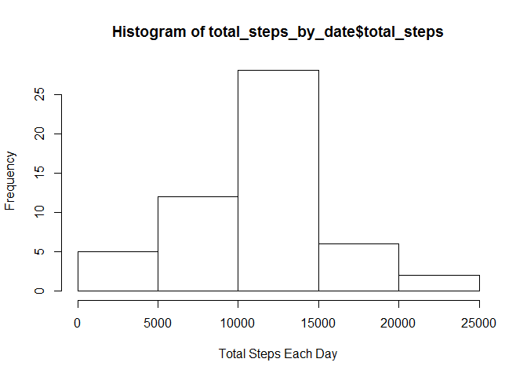
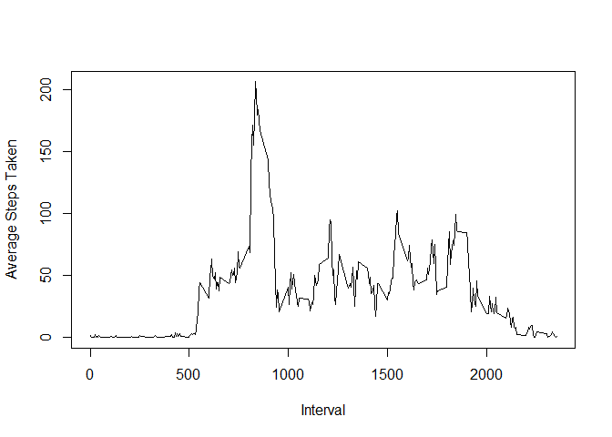
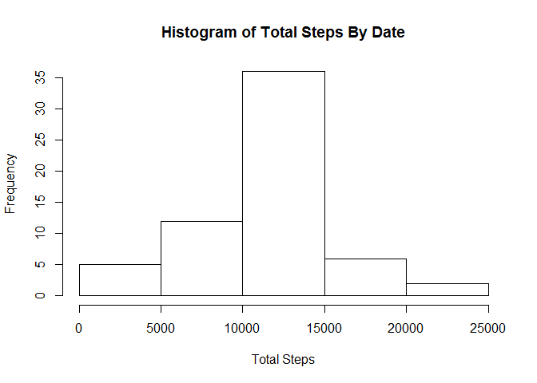
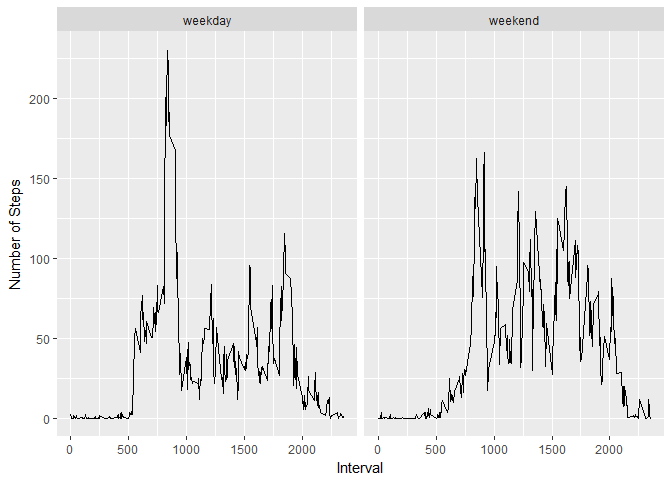

# Reproducible Research: Peer Assessment 1


## Loading and preprocessing the data


The "is_nas" parameter of the function allows us to filter NA step observations from the data.

```r
load_data <- function(is_nas = FALSE)
{
    if(is_nas)
    {
        activity_data <- read.csv("activity.csv", header=TRUE)
        return(activity_data)
    }else
    {
        activity_data <- read.csv("activity.csv", header=TRUE)
        activity_data[!is.na(activity_data$steps), ]
    }
}
```


## What is mean total number of steps taken per day?


```r
total_activity <- function()
{
    
    activity_data <- load_data()
    
    ## What is mean total number of steps taken per day?
    
    # Group data by date and find total steps by date.
    by_date <- group_by(activity_data, date)
    total_steps_by_date <- summarise(by_date, total_steps=sum(steps))
    
    # 1. Make a histogram of the total number of steps taken each day
    hist(total_steps_by_date$total_steps, xlab = "Total Steps Each Day")
    
    # 2. Calculate and report the mean and median total number of steps taken per day
    
    cat("Mean = ", mean(total_steps_by_date$total_steps), "\n")
    cat("Median = ",median(total_steps_by_date$total_steps), "\n")
    
}
```

<!-- -->

```
## Mean =  10766.19 
## Median =  10765
```

## What is the average daily activity pattern?

```r
average_activity <- function()
{
    activity_data <- load_data()
    ## What is the average daily activity pattern?
    # Group data by 5-minute interval period and find total steps and mean_steps per interval
    by_interval <- group_by(activity_data, interval)
    mean_interval <- summarise(by_interval, total_steps=sum(steps), mean_steps=mean(steps))
    # 1. Make a time series plot (i.e. type = "l") of the 5-minute interval (x-axis) 
    # and the average number of steps taken, averaged across all days (y-axis)
    plot(x = mean_interval$interval, y=mean_interval$mean_steps, type = "l", xlab = "Interval", ylab="Average Steps Taken")
    
    # 2. Which 5-minute interval, on average across all the days in the dataset, contains the maximum number of steps?
    max_steps <- mean_interval[mean_interval$mean_steps == max(mean_interval$mean_steps),]$interval
    cat("Interval with the maximum number of steps across all days = ", max_steps,"\n")
}
```

<!-- -->

```
## Interval with the maximum number of steps across all days =  835
```


## Imputing missing values

```r
create_mean_interval_data <- function()
{
    activity_data <- load_data()
    by_interval <- group_by(activity_data, interval)
    mean_interval <- summarise(by_interval, total_steps=sum(steps), mean_steps=mean(steps))
}

missing_data <- function()
{
  
    ## Imputing missing values
    activity_data <- load_data(TRUE)
    
    # 1. Calculate and report the total number of missing values in the dataset (i.e. the total number of rows with NAs)
    cat("Total Missing Steps = ", sum(is.na(activity_data$steps)),"\n")
    
    # 2. Devise a strategy for filling in all of the missing values in the dataset.
    print("Using the mean for the 5-minute interval as a replacement for NA values.")
    
    # 3. Create a new dataset that is equal to the original dataset but with the missing data filled in.

    mean_interval <- create_mean_interval_data()
    
    for(i in 1:dim(activity_data)[1])
    {
        if(is.na(activity_data[i,]$steps))
        {
            missing_steps <- mean_interval[mean_interval$interval == activity_data[i,]$interval, ]$mean_steps
            activity_data[i,]$steps <- missing_steps
        }
    }
    
    # 4.Make a histogram of the total number of steps taken each day and Calculate 
    # and report the mean and median total number of steps taken per day.
    by_date <- group_by(activity_data, date)
    total_steps_by_date <- summarise(by_date, total_steps=sum(steps))
    
    hist(total_steps_by_date$total_steps, main = "Histogram of Total Steps By Date", xlab="Total Steps")
    
    cat("Mean total steps by Date = ", mean(total_steps_by_date$total_steps), "\n")
    cat("Median total steps by Date=", median(total_steps_by_date$total_steps), "\n")
    
    ##activity_data <- mutate(activity_data, wd = weekdays(as.Date(date)))
    activity_data$weekends <- ifelse(test = weekdays(as.Date(activity_data$date)) == "Saturday" 
                                    | weekdays(as.Date(activity_data$date)) == "Sunday"
                                    , "weekend", "weekday")
   
   
   by_interval <- group_by(activity_data, weekends, interval)
   mean_data <- summarise(by_interval, total_steps=sum(steps), mean_steps=mean(steps))
   
   qplot(interval, y = mean_steps, data=mean_data, facets = .~weekends,xlab="Interval",  ylab = "Number of Steps", geom="line")
}
```


```
## Total Missing Steps =  2304 
## [1] "Using the mean for the 5-minute interval as a replacement for NA values."
```

<!-- -->

```
## Mean total steps by Date =  10766.19 
## Median total steps by Date= 10766.19
```

<!-- -->

The mean and median are very close to that of the original values in which the NAs were removed.  In this particular case, it seems as though imputing data had a negligible effect on the mean and median.  However, it did have an effect on the total number of steps reported by the histogram.  It rose the total number of steps taken overall.

## Are there differences in activity patterns between weekdays and weekends?

During both weekdays and weekends, there is a brief spike in activity early in the day and a lull towards the end of the day. However, the weekend seems to have a has a higher average of sustained activity.
